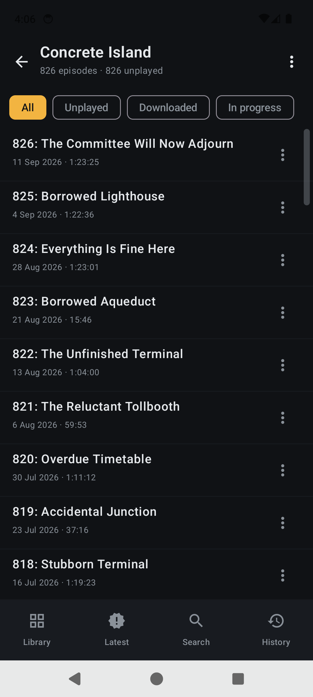
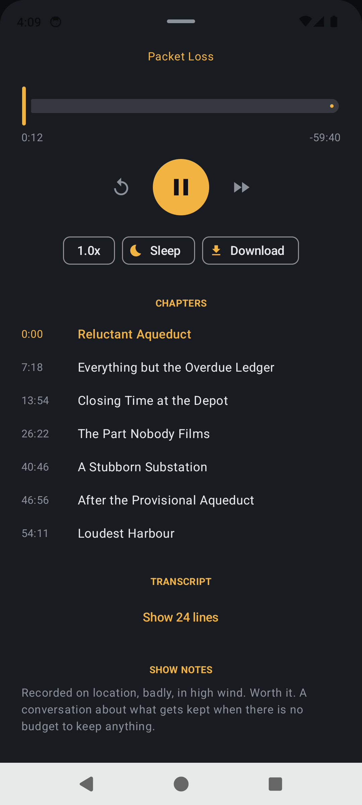
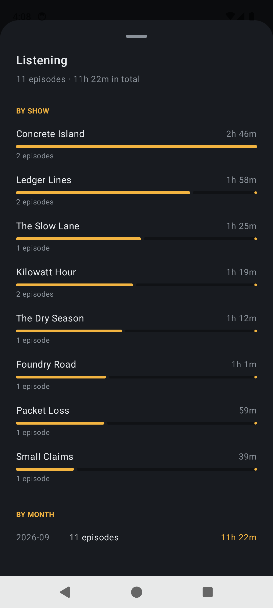
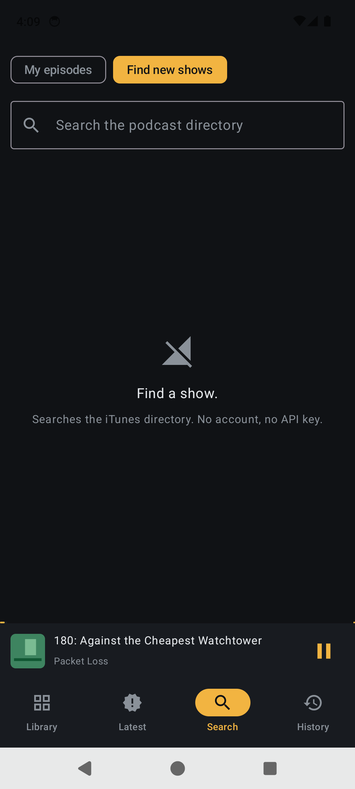
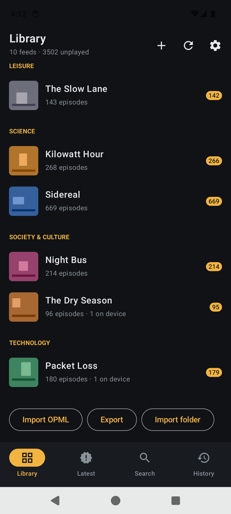
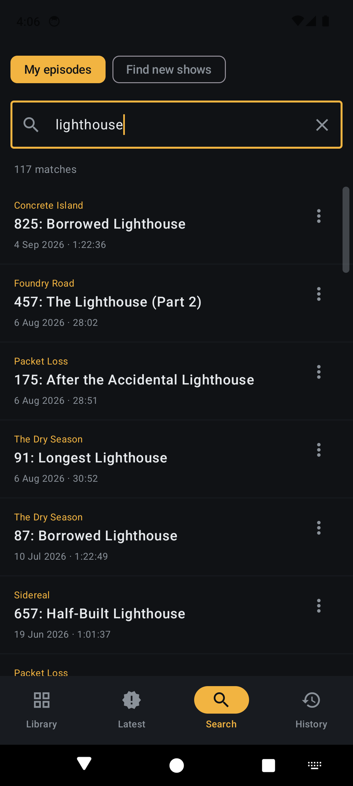
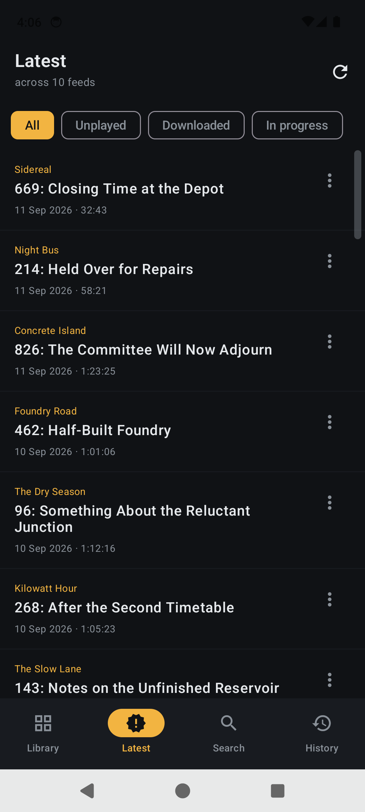
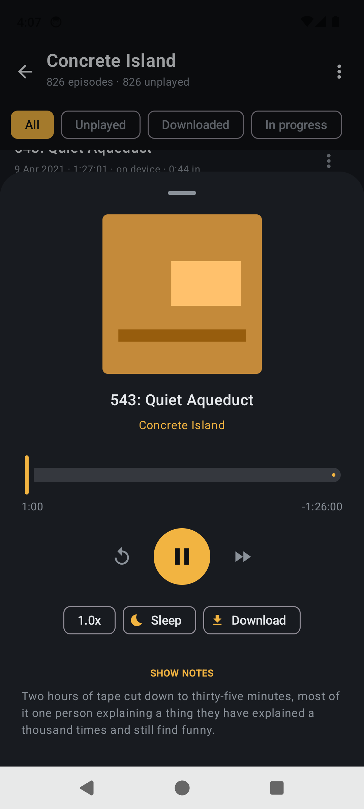

<h1>Deadzone</h1>

**Your whole podcast hoard, on your phone, with no signal.**

Subscribe to RSS feeds, keep the audio on the device, and listen in a basement, on a
plane, or three miles up a trail with no bars. Nothing in the app waits on a network
— not the library, not the episode list, not search across every show note you have.

<table>
<tr>
<td align="center"><br><sub>Cold start, no signal at all</sub></td>
<td align="center"><br><sub>3,513 episodes, searched offline</sub></td>
<td align="center"><br><sub>Grouped, with what's unplayed</sub></td>
<td align="center"><br><sub>826 episodes in one drag</sub></td>
</tr>
<tr>
<td align="center"><br><sub>Filter a show's back catalogue</sub></td>
<td align="center"><br><sub>Speed, sleep timer, show notes</sub></td>
<td align="center"><br><sub>Chapters, when a feed has them</sub></td>
<td align="center"><br><sub>Play, queue, download, mark played</sub></td>
</tr>
<tr>
<td align="center"><br><sub>What you finished, and when</sub></td>
<td align="center"><br><sub>Hours by show and by month</sub></td>
<td align="center"><br><sub>Wi-Fi only, auto-delete, adopt</sub></td>
<td align="center"><br><sub>Directory search, no API key</sub></td>
</tr>
<tr>
<td align="center"><br><sub>A mounted share, adopted</sub></td>
<td align="center"><br><sub>Show notes are searched too</sub></td>
<td align="center"><br><sub>Newest across every feed</sub></td>
<td align="center"><br><sub>Downloaded, and playing from disk</sub></td>
</tr>
</table>

---

## The two ideas

**1. The database is the app.** Every screen reads from SQLite and nothing else. The
network never draws a pixel — it only writes rows. So there is no offline *mode* to
enter, because there was never an online one; aeroplane mode changes nothing about
what any screen does. Sync becomes a background job that mutates a table, and it is
free to fail, repeatedly, without a single screen noticing.

**2. A file you already own and a file the app downloaded are the same row.** Point
Deadzone at a folder — Music, Downloads, an SD card, a mounted NFS or SMB share — and
it matches the audio in it against your feeds. What it recognises is attached to that
episode; what it doesn't is kept anyway, as a local show named after its folder or its
album tag. From then on the app cannot tell the difference, and does not need to: same
column, same playback path. A back catalogue you already have never gets downloaded
twice, and nothing you point it at is silently discarded.

Notably, **Deadzone speaks no network filesystem at all.** Android's file picker
already reaches anything mounted, so "mount the share however you like, then point the
app at the folder" works for NFS, SMB, USB-OTG and an SD card alike, for no protocol
code. Mount it, import it, unmount it — the audio is on the phone now.

## What it does

| | |
|---|---|
| **Works with no network** | Library, episodes, show notes, search, playback of anything on the device. Cold start included. |
| **Searches everything** | Full-text over every title and every show note, on the phone. 3,513 episodes return in under a second. |
| **Handles a big collection** | A drag rail on any list over 40 rows, showing the month you're passing through. 826 episodes is one gesture. |
| **Remembers where you were** | Resume position per episode, saved every five seconds. Finished episodes land in History with the date you finished them. |
| **Fetches by itself** | Keep the newest *N* per feed, on unmetered networks only, resuming part-downloads rather than restarting them. |
| **Cleans up after itself** | Finished downloads older than 7 / 30 / 90 days are deleted; the feed entry and your history stay. |
| **Imports and exports OPML** | Bring a subscription list in whole, and take it out again. Folders become categories. |
| **Adopts a folder you already have** | Any folder the file picker can reach. What matches a feed you follow is attached to it; the rest becomes a local show, so nothing is dropped. |
| **Finds new shows** | Searches the iTunes directory. No account, no API key, nothing to register for. |
| **Counts what you listened to** | Hours per show and per month, from play history that was already being recorded. |
| **Works in the car** | An Android Auto browse tree: Continue, Downloaded, Queue, and every show. |
| **Shows chapters and transcripts** | When a feed publishes them — tap a chapter or a transcript line to seek there. |

Plus the things a podcast app is not allowed to get wrong: background playback with
the screen off, lock-screen and bluetooth controls, pausing when the headphones come
out, back-15 / forward-30, playback speed, and a sleep timer.

## Start

**[Download the latest APK](https://github.com/sp00nznet/deadzone/releases/latest)** —
signed release build, Android 8.0+. Or build it:

```bash
./gradlew :app:assembleDebug
adb install -r app/build/outputs/apk/debug/app-debug.apk
```

Paste an RSS URL, or hit **Import OPML** and bring your whole list at once. Set
**auto-download** per feed from the ⋮ menu and it fills itself in over Wi-Fi from then
on.

Already have the audio? **Import folder** in the library adopts anything the file
picker can reach — see [docs/setup.md → Adopting audio you already have](docs/setup.md#adopting-audio-you-already-have).

## Docs

- **[design.md](docs/design.md)** — how it works, and what was traded away
- **[setup.md](docs/setup.md)** — building, signing, feeds, and adopting a collection
- **[roadmap.md](docs/roadmap.md)** — what is next
- **[testing.md](docs/testing.md)** — the checks, and the bugs only a real device found

## Layout

| File | |
|---|---|
| `Feed.kt` | RSS, Atom, OPML and transcript parsing. Pure, and unit-tested |
| `Match.kt` | Working out which episode a file on disk is. Pure, and unit-tested |
| `Store.kt` | SQLite — feeds, episodes, positions, history, full-text search, statistics |
| `Sync.kt` | Fetching, resumable downloads, directory search, the background job |
| `Import.kt` | Walking a picked folder and adopting what is in it |
| `PlayerService.kt` | The media session, and the Android Auto browse tree |
| `MainActivity.kt` | `Vm` — all state, the screen stack, every action |
| `Screens.kt` | The UI |
| `tools/sideload.py` | The same adoption from a desktop, over adb. Stdlib only |
| `tools/demo_feeds.py` | Invented podcasts to screenshot and test against. Stdlib only |

Eight Kotlin files. No dependency injection, no navigation library, no repository
layer, no ORM.

## A note on the screenshots

Every screenshot above is of a library that does not exist. `tools/demo_feeds.py`
serves ten invented shows over HTTP — the names, the cover art, the episode titles and
every word of the show notes are made up, and the audio is silence.

That is deliberate. Screenshots of a podcast client are the easiest way to end up
redistributing somebody else's artwork and copy, and a repo is a distribution. Using
a fixture also makes the screenshots reproducible:

```bash
python tools/demo_feeds.py            # then add the printed feeds in the app
python tools/demo_feeds.py --print-feeds
```

Cleartext HTTP to the emulator's host alias is permitted **in debug builds only**
(`app/src/debug/`). The release APK keeps Android's default and refuses cleartext
entirely.

## A note on feed URLs

Nothing in this repo contains a feed URL, and nothing should. A paid feed's URL
(Patreon and friends) carries an `auth=` token that is a bearer credential — anyone
holding it can read your paid subscription as you. `seed/` and `*.opml` are in
`.gitignore` for that reason. Keep your list local, or export it to somewhere private.

## Built on

Deadzone is a thin thing on top of other people's work. All of the below are
Apache-2.0, and all of it ships inside the APK:

| | |
|---|---|
| [AndroidX & Jetpack Compose](https://developer.android.com/jetpack) | UI, lifecycle, WorkManager |
| [Media3 / ExoPlayer](https://github.com/androidx/media) | Playback, the media session, Android Auto |
| [OkHttp](https://square.github.io/okhttp/) | Every HTTP request |
| [Coil](https://coil-kt.github.io/coil/) | Artwork loading and caching |
| [Kotlin](https://kotlinlang.org) & [Gradle](https://gradle.org) | Language and build |

Episode discovery uses the public [iTunes Search API](https://performance-partners.apple.com/search-api).
Feeds are read per the [RSS 2.0](https://www.rssboard.org/rss-specification) and
[Podcasting 2.0](https://podcastindex.org/namespace/1.0) specifications.

## Licence

MIT — see [LICENSE](LICENSE). The Apache-2.0 dependencies above remain under their
own licence.
