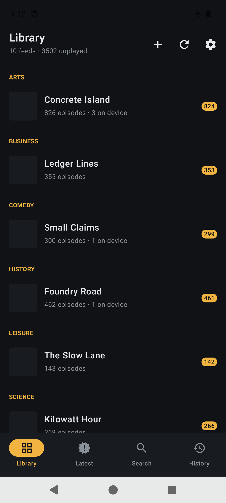
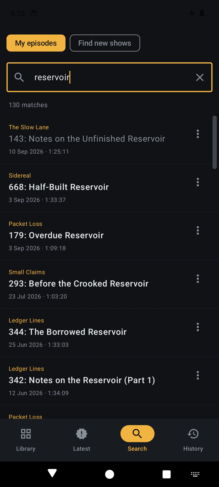
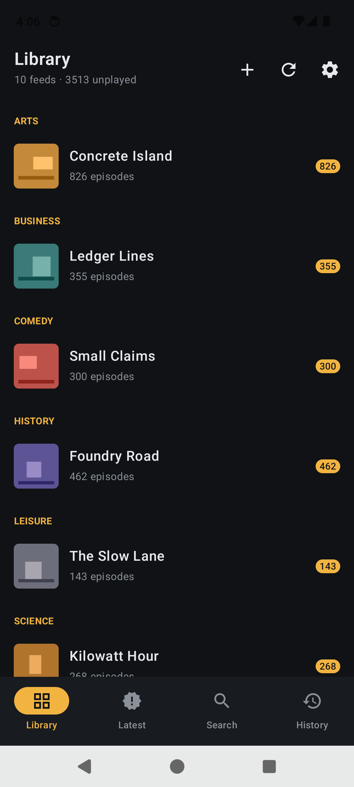
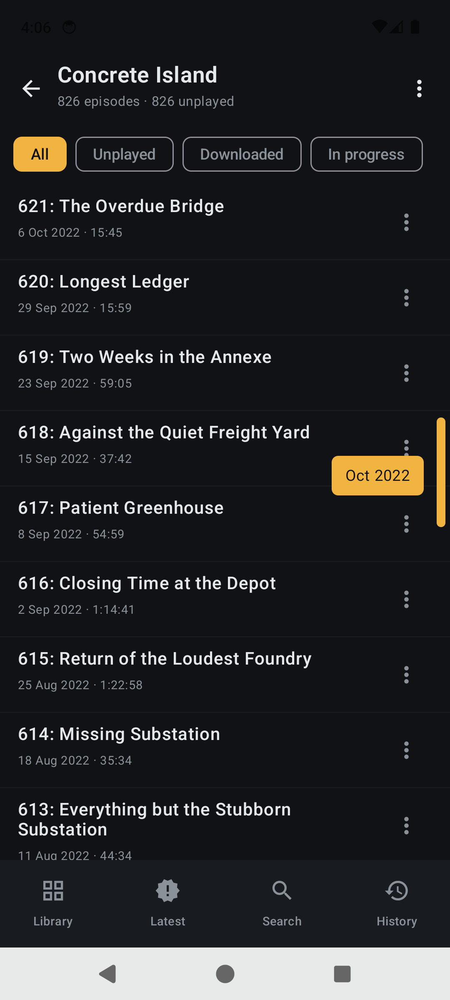
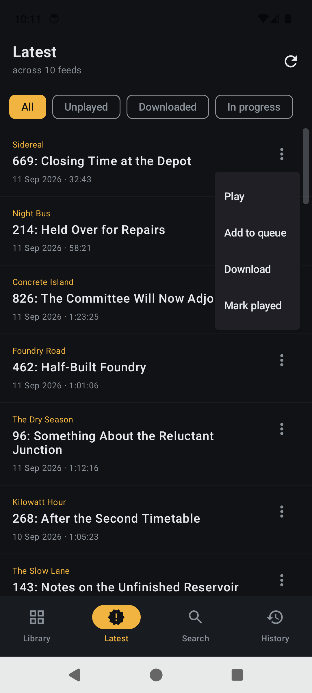
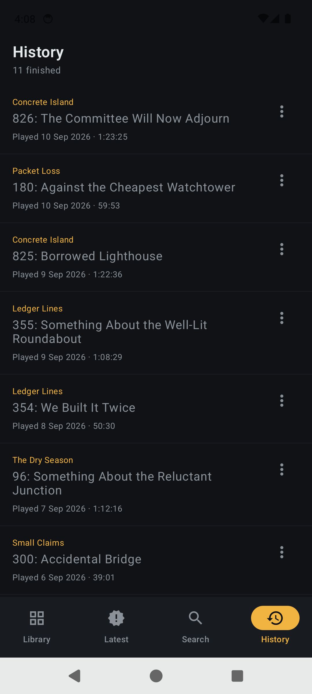
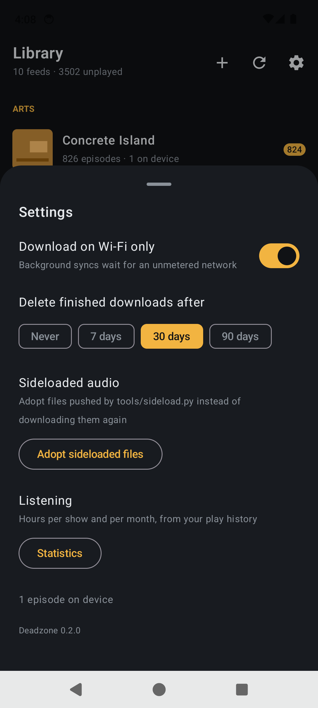

<h1>Deadzone</h1>

**Your whole podcast hoard, on your phone, with no signal.**

Subscribe to RSS feeds, keep the audio on the device, and listen in a basement, on a
plane, or three miles up a trail with no bars. Nothing in the app waits on a network
— not the library, not the episode list, not search across every show note you have.

<table>
<tr>
<td align="center"><br><sub>Cold start, no signal at all</sub></td>
<td align="center"><br><sub>4,031 episodes, searched offline</sub></td>
<td align="center"><br><sub>Grouped, with what's unplayed</sub></td>
<td align="center"><br><sub>825 episodes in one drag</sub></td>
</tr>
<tr>
<td align="center"><br><sub>Speed, sleep timer, show notes</sub></td>
<td align="center"><br><sub>On device, and where you got to</sub></td>
<td align="center"><br><sub>What you finished, and when</sub></td>
<td align="center"><br><sub>Wi-Fi only, auto-delete, adopt</sub></td>
</tr>
</table>

---

## The two ideas

**1. The database is the app.** Every screen reads from SQLite and nothing else. The
network never draws a pixel — it only writes rows. So there is no offline *mode* to
enter, because there was never an online one; aeroplane mode changes nothing about
what any screen does. Sync becomes a background job that mutates a table, and it is
free to fail, repeatedly, without a single screen noticing.

**2. A file you already own and a file the app downloaded are the same row.** If you
have a podcast collection on a drive somewhere, `tools/sideload.py` matches those
files to entries in the real feed, pushes them over adb, and links them by GUID. From
then on the app cannot tell the difference, and does not need to: same column, same
playback path, same auto-delete rules. A back catalogue you already have never gets
downloaded twice.

## What it does

| | |
|---|---|
| **Works with no network** | Library, episodes, show notes, search, playback of anything on the device. Cold start included. |
| **Searches everything** | Full-text over every title and every show note, on the phone. 4,031 episodes return in under a second. |
| **Handles a big collection** | A drag rail on any list over 40 rows, showing the month you're passing through. 825 episodes is one gesture. |
| **Remembers where you were** | Resume position per episode, saved every five seconds. Finished episodes land in History with the date you finished them. |
| **Fetches by itself** | Keep the newest *N* per feed, on unmetered networks only, resuming part-downloads rather than restarting them. |
| **Cleans up after itself** | Finished downloads older than 7 / 30 / 90 days are deleted; the feed entry and your history stay. |
| **Imports and exports OPML** | Bring a subscription list in whole, and take it out again. Folders become categories. |

Plus the things a podcast app is not allowed to get wrong: background playback with
the screen off, lock-screen and bluetooth controls, pausing when the headphones come
out, back-15 / forward-30, playback speed, and a sleep timer.

## Start

**[Download the latest APK](https://github.com/sp00nznet/deadzone/releases/latest)** —
signed release build, Android 8.0+. Or build it:

```bash
./gradlew :app:assembleDebug
adb install -r app/build/outputs/apk/debug/app-debug.apk
```

Paste an RSS URL, or hit **Import OPML** and bring your whole list at once. Set
**auto-download** per feed from the ⋮ menu and it fills itself in over Wi-Fi from then
on.

Already have the audio? See [docs/setup.md → Sideloading](docs/setup.md#sideloading).

## Docs

- **[design.md](docs/design.md)** — how it works, and what was traded away
- **[setup.md](docs/setup.md)** — building, signing, feeds, and sideloading a collection
- **[roadmap.md](docs/roadmap.md)** — what is next
- **[testing.md](docs/testing.md)** — the checks, and the four bugs only a real device found

## Layout

| File | |
|---|---|
| `Feed.kt` | RSS, Atom and OPML parsing. Pure, and unit-tested |
| `Store.kt` | SQLite — feeds, episodes, positions, history, full-text search |
| `Sync.kt` | Fetching, resumable downloads, the background job, settings |
| `PlayerService.kt` | The media session. Background audio and hardware controls |
| `MainActivity.kt` | `Vm` — all state, the screen stack, every action |
| `Screens.kt` | The UI |
| `tools/sideload.py` | Matches a local collection to feeds and pushes it. Stdlib only |

Six Kotlin files. No dependency injection, no navigation library, no repository layer,
no ORM.

## A note on feed URLs

Nothing in this repo contains a feed URL, and nothing should. A paid feed's URL
(Patreon and friends) carries an `auth=` token that is a bearer credential — anyone
holding it can read your paid subscription as you. `seed/` and `*.opml` are in
`.gitignore` for that reason. Keep your list local, or export it to somewhere private.

## Licence

MIT — see [LICENSE](LICENSE).
